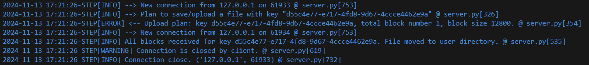
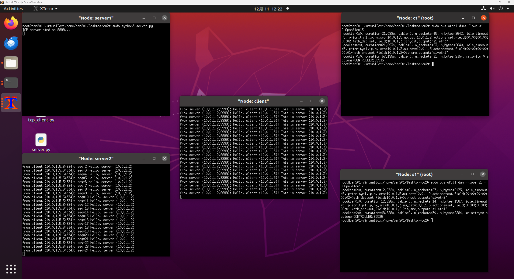

# CAN201 Networking Project: From Sockets to SDN


This repository contains the coursework for the CAN201 Introduction to Networking module. The project is a comprehensive exploration of networking principles, divided into two distinct parts:

1.  **Part I: Socket-Based File Transfer**: A client-server application for reliable file transfers using Python's native socket programming and a custom TCP-based protocol.
2.  **Part II: SDN Traffic Manipulation**: An emulation of a Software-Defined Network (SDN) using Mininet and Ryu to dynamically control and redirect network traffic.

---

## Part I: Socket-File-Transfer

This part of the project focuses on the fundamentals of network programming by building a robust client-server file transfer application. The server code was first debugged to ensure stability, followed by the development of a feature-rich client with a graphical user interface.

### Demo (Part I)


*(Note: This is a placeholder. You should replace this with a screenshot of your running `client.py` GUI.)*

### Features

*   **Custom TCP Protocol (STEP)**: Implements the "Simple Transfer and Exchange Protocol" using JSON for metadata and binary for file data, ensuring reliable, in-order delivery.
*   **GUI Client**: An intuitive graphical interface built with Tkinter allows users to connect to the server, log in, and perform file operations easily.
*   **Secure Authorization**: The client logs in with a username, which is then hashed (MD5) and sent as a password. A successful login returns a session token used for all subsequent authenticated actions.
*   **Multi-threaded File Uploads**: Utilizes a thread pool (`ThreadPoolExecutor`) to upload file chunks (blocks) in parallel, significantly improving transfer speeds for large files.
*   **Full File Management**: Supports uploading, downloading, listing, and deleting files on the server.
*   **Data Integrity Verification**: Uses MD5 checksums to verify that files are received correctly by the server after an upload is complete.

### File Structure

```
Socket-File-Transfer/
├── client.py   # The GUI client application with multi-threading logic.
└── server.py   # The multi-threaded TCP server that handles the STEP protocol.
```

### How to Run

1.  **Start the Server**:
    Open a terminal and run the server script. It will be ready to accept connections.
    ```bash
    python server.py
    ```

2.  **Run the Client**:
    Open a second terminal and run the client script. This will launch the Tkinter GUI.
    ```bash
    python client.py
    ```
    In the GUI, enter a username (e.g., "testuser") and click "Connect and Login" to start.

---

## Part II: SDN-Traffic-Manipulation-with-Ryu

This part explores modern networking concepts by creating a Software-Defined Network (SDN) to dynamically manage traffic flow. It uses Mininet to emulate the network topology and the Ryu framework to act as the SDN controller.

### Demo (Part II)


*(Note: This is a placeholder. You should replace this with a screenshot of your terminals running Mininet and Ryu.)*

### Key Components & Scenarios

*   **`networkTopo.py`**: A Mininet script that programmatically builds the network topology consisting of one client, two servers, and an OpenFlow switch connected to a remote Ryu controller.

*   **Scenario 1: Dynamic Forwarding (`ryu_forward.py`)**
    This controller acts as a learning switch. When a packet arrives at the switch with no matching flow rule, it sends the packet to the controller (`Packet-In`). The controller learns the source MAC address's location and installs a flow rule in the switch to forward future packets to that destination directly, avoiding further controller intervention.

*   **Scenario 2: Traffic Redirection (`ryu_redirect.py`)**
    This more advanced controller demonstrates the power of SDN. It inspects incoming traffic and, if the traffic is from the client to Server1, it transparently redirects it to Server2. It does this by modifying the destination MAC and IP addresses of the packets and installing a corresponding flow rule. Return traffic from Server2 is also modified to appear as if it came from Server1, making the redirection completely invisible to the client.

### File Structure

```
SDN-Traffic-Manipulation-with-Ryu/
├── networkTopo.py    # Mininet script to create the SDN topology.
├── ryu_forward.py    # Ryu controller for dynamic L2 forwarding.
└── ryu_redirect.py   # Ryu controller for L3 traffic redirection.
```

### How to Run

**Prerequisites**: You must have **Mininet** and the **Ryu SDN Framework** installed.

**Running a Scenario (Example: Redirection)**

1.  **Start the Ryu Controller**:
    Open a terminal and run the Ryu manager with the desired controller script.
    ```bash
    ryu-manager ryu_redirect.py
    ```

2.  **Start the Mininet Topology**:
    Open a second terminal and run the topology script with `sudo`. This will create the virtual network and connect it to the Ryu controller.
    ```bash
    sudo python networkTopo.py
    ```
    This will open a Mininet CLI (`mininet>`).

3.  **Test the Network**:
    Inside the Mininet CLI, you can test connectivity and observe the controller's behavior. For example, to test redirection:
    *   Start a simple server on Server2: `server2 python -m http.server 80 &`
    *   Try to fetch a file from Server1 using the client (it will be redirected to Server2): `client wget -O - 10.0.1.2`
    *   You can also use `pingall` to test basic connectivity.

---

## Technical Concepts Demonstrated

This project covers a wide range of networking concepts, from low-level transport protocols to high-level network programmability.

*   **TCP/IP & Socket Programming**
*   **Client-Server Architecture**
*   **Custom Protocol Design (JSON + Binary)**
*   **Multi-threading and Concurrency**
*   **Data Integrity (MD5 Hashing)**
*   **Software-Defined Networking (SDN)**
*   **OpenFlow Protocol**
*   **Network Emulation (Mininet)**
*   **SDN Controller Logic (Ryu)**
